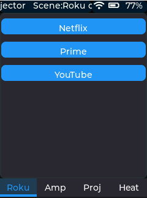

## Pages
Each page within a scene is defines by a page JSON file.  Page files are normally grouped in the /Pages subdirectory.  The contents of a typical page file might look like this:

```json
{
  "CommandFile":"Commands/Commands_Roku.json",
  "Widgets": 
  [
    {
      "Type":"Button",
      "Text":"Netflix",
      "Command":"NETFLIX",
      "HeightPct":10,
      "AlignTo":0
    },
    {
      "Type":"Button",
      "Text":"Prime",
      "Command":"PRIME",
      "HeightPct":10,
      "AlignTo":1
    },
    {
      "Type":"Button",
      "Text":"YouTube",
      "Command":"YOUTUBE",
      "HeightPct":10,
      "AlignTo":2
    }
  ],
  "ButtonMaps":
  {
    "Up":{"Press":"UP"},
    "Down":{"Press":"DOWN"},
    "Left":{"Press":"LEFT"},
    "Right":{"Press":"RIGHT"},
    "Center":{"Press":"SELECT"},
    "Home":{"Press":"HOME"},
    "Back":{"Press":"BACK"},
    "Info":{"Press":"INFO"},
    "Menu":{"Press":"MENU"},
    "Play":{"Press":"PLAY_PAUSE"},
    "Pause":{"Press":"PLAY_PAUSE"},
    "Stop":{"Press":"BACK"},
    "Rewind":{"Press":"REVERSE"},
    "FastForward":{"Press":"FORWARD"}
  }
}
```
	
This would create a single page within the scene tabview that looks like this:
<div align="center">
  
</div

The fields are:
* **CommandFile** - filename of the JSON file that contains the command codes to be used for this page.  Each page can only use a single file.
* **Widgets** - an array of widgets that are to be added to the GUI for this page.  See below for further details.
* **ButtonMaps** - A list of physical button to command mappings.  On each line the first entry is the [physical key code](https://github.com/OMOTE-Community/OMOTE-Firmware-object-oriented/blob/a8268516d815e16a7e3459c7bb56e2b30a0ab436/Platformio/lib/HAL/Hardware/KeyPressAbstract.hpp#L9-L50), the second element is the combination of press type (Press, Release, Repeat, Long or Short) and the command name from the JSON commands file.

Currently the widget and customisation types supported are relatively basic.  Either stick to the types seen in the example json files or review the [JsonPage.cpp](https://github.com/OMOTE-Community/OMOTE-Firmware-object-oriented/blob/dev/Platformio/lib/JsonConfigUI/page/JsonPage.cpp) file to see what's supported.  An overview is:
* **Type** - Currently either Button, Title, Label, Image, ColorButtons, NumberPad
* **Text** - Label or Button text
* **Command** - For Button, ColorButtons or NumberPad.  Command to send when pressed.  Single entry for Button or array of commands for the other two.  For Labels this can also be used to subscribe to MQTT messages (the label will automatically update when the associated message is received)
* **HeightPct** - Height of the widget as a % of the parent widget
* **AlignTo** - How to align the widget relative to other widgets.  A 0 means align relative to the top of the screen, 1 means align relative to the 1st widget on this page, 2 means align to the 2nd widget and so on.
* **SizeXY** - Button only.  Two value array giving the size [X, Y] for the widget in pixels
* **PosX** - Button or Image.  Set the X position of the button in % of screen width.
* **PosY** - Button or Image.  Set the Y position of the button in % of screen height.