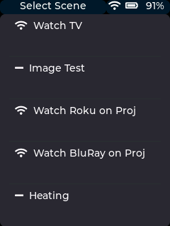

## Scenes
The JSON UI relies heavily on the concept of scenes.  A scene combines a number of pages into a single scrollable tabview.  It also allows scene specific physical key overrides and scene entry/exit macros to be defined.

### Scenes Definition File (Scenes.json)
A scene definition JSON file defines the available scenes on the OMOTE.  A typical file will look like this:

```json
{
  "Scenes":[
    {"SceneName":"Watch TV", "FileName":"Scenes/Scene_WatchTV.json","BindToKey":"TV","PressType":"Press"},
    {"SceneName":"Image Test", "FileName":"Scenes/Scene_ImageTest.json"},
    {"SceneName":"Watch Roku on Proj", "FileName":"Scenes/Scene_WatchRokuOnProj.json", "BindToKey":"Stream", "PressType":"Long"},
    {"SceneName":"Watch BluRay on Proj", "FileName":"Scenes/Scene_WatchBluRayOnProj.json", "BindToKey":"BluRay", "PressType":"Long"},
    {"SceneName":"Heating", "FileName":"Scenes/Scene_Heating.json"}
  ]
}
```
	
This would create an OMOTE Homescreen that looks like this:
<div align="center">
  
</div

The JSON syntax is hopefully fairly self explanatory, the main fields are:
* **SceneName** - What the scene will be called in the list.
* **FileName** - the name of the LittleFS file that contains the scene definition.  Scenes are normally grouped in the Scenes/ subdirectory.
* **BindToKey** - This allows the scene to be bound to a specific physical keypad key.  Pressing the key will trigger the scene to start.  Valid keynames can be found in the keys.hpp file ([Keys](https://github.com/OMOTE-Community/OMOTE-Firmware-object-oriented/blob/dev/Platformio/lib/esp32HalImpl/keys/keys.hpp))
* **PressType** - What type of press type to use, valid types are Short and Long

### Scene Entry/Exit and Entry Sequence Icon
Entry and exit sequences will be described further within the Scene section but there are a couple of points also worth mentioning here first.  Scenes, while convenient, can be troublesome.  For example managing to turn everything off by accidentally selecting the wrong scene can be irritating.

When entering a scene the entry sequence will always be sent UNLESS the same scene is already active.

Similarly it is possible to return to the Homescreen either with or without sending the exit sequence.  A short press on the power button, or a tap on the left hand side of the status bar will return to the Homescreen without exiting the scene and without sending the exit sequence.  The active scene name will still be shown in the status bar to indicate this.  The scene key overrides will also still be in effect.  

A long press on the power button will cancel the scene, send the exit sequence and return to the Homescreen.  This will be indicated by the status bar showing 'Select Scene'

Scenes without entry sequences are indicated with the '**-**' icon.  These can be selected without sending entry/exit sequences.

Scenes with the broadcast icon have sequences.  If selected when a different scene is still active the exit sequence for the old scene will be sent followed by the entry sequence for the new scene.

**Note:** There could well still be bugs in the scene implementation, if found please raise and issue on Github or Discord.

### Scene Definition File
Each scene has it's own definition file.  An example file (Scene_WatchRokuOnProj.json) might look like this:
	
```json
{
  "Type":"Scene",
  "ScreenName":"Roku on Projector",
  "Pages": [
    {
      "PageName":"Roku Player",
      "ShortName":"Roku",
      "FileName":"Pages/Page_Roku.json",
      "OverrideKeys":["Stop", "Rewind", "Play","FastForward", "Pause"]
    },
    {
      "PageName":"AV Receiver",
      "ShortName":"Amp",
      "FileName":"Pages/Page_AVReceiver.json",
      "OverrideKeys":["VolUp", "VolDown", "Mute"]
    },
    { 
      "PageName":"Projector",
      "ShortName":"Proj",
      "FileName":"Pages/Page_Projector.json"
    },
    {
      "PageName":"Heating (Lounge)",
      "ShortName":"Heat",
      "FileName":"Pages/Page_Heating.json",
      // Include a command prefix to allow generic page
      // to control specific room
      "CommandPrefix":"LOUNGE_"
    }
  ],
  "StartCommandSequence":[
    {"CommandFile":"Commands/Commands_SonyProjector.json",   "Command":"PWR_ON"},
    {"CommandFile":"Commands/Commands_YamahaAmpMain.json",   "Command":"TV"}
  ],
  "ExitCommandSequence":[
    {"CommandFile":"Commands/Commands_YamahaAmpMain.json",   "Command":"PWR_OFF"},
    {"CommandFile":"Commands/Commands_SonyProjector.json",   "Command":"PWR_OFF"}
  ]
}
```

Which would generate a scene page with 4 tabs that looks like this:
<div align="center">
  
</div

Again, hopefully the syntax is fairly self explanatory but the following provides an overview:

* **Type** - Currently not used, may be used or deleted in the future
* **ScreenName** - The scene name used in the Status bar, if not supplied then the filename will be used
* **Pages** - Array of pages that are contained within this scene, see below for further details.
* **StartCommandSequence** - a sequence of commands that will be sent when entering the scene.
* **ExitCommandSequence** - a sequence of commands that will be sent when exiting the scene.

The Pages entry should contain:
* **PageName** - used to display a name at the top of a page.  Note: only visible if the page definition contains a Title widget.
* **ShortName** - used to label the tabs at the bottom of the page.  Available space depends on the number of pages within the scene and so the number of tabs but needs to be kept short.
* **FileName** - name of the page definition JSON file for this page
* **OverrideKeys (optional)** - a list of the keys from this page that should act as overrides over any definitions in any other page in this scene, i.e. if VolUp is included then the key association for the VolUp key in this page will always be sent if the key is pressed in any page in this scene.
* **CommandPrefix (optional)** - this is normally only used with MQTT commands.  It allows a single page definition to be used multiple times to control multiple physical MQTT entities by adding a prefix to the command topic.  For example the Lounge heating page could have a "LOUNGE_" prefix which would change the MQTT command used in the page from "ADVANCE" to "LOUNGE_ADVANCE".	
	