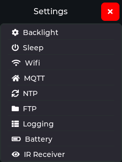
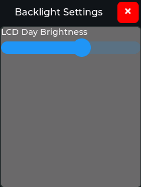
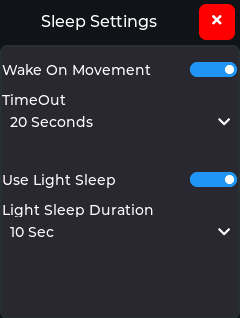
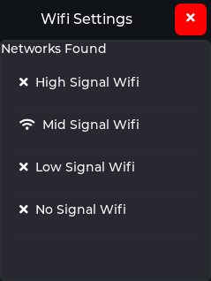
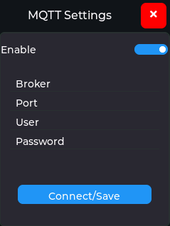
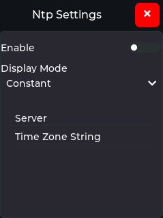
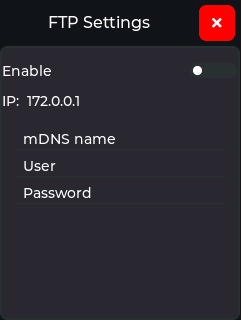
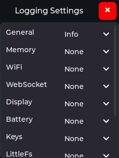
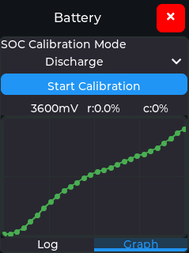
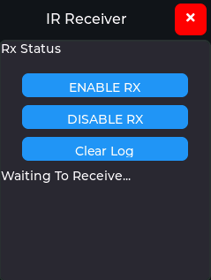

## OMOTE Status Bar
The STatus Bar is positioned at the top of most screens.

The right hand side provides details of the WiFi status and battery level.  The final field can either be the battery State Of Charge (SOC) in % or the current time.  Tapping on the right hand side of the status bar opens the Settings Menu.

The left hand side use is dependant on which UI is being used.  For the Home Assist UI it is used to display/access the active device selection menus.  For the JSON UI it is used to display/select the current scene.

## OMOTE Settings Menu

  

The settings menu allows the OMOTE to be configured, there are sub-menus for each area:

### Backlight Settings

  

  

  

  

  

  

  

  

  
</div

While not a settings menu the IR Receiver screen is also available under settings.  It allows the OMOTE to receive, and decode, IR commands sent by other remotes.  This is typically used to learn IR commands which can then be used by the OMOTE.  To use click "ENABLE RX" to power up the IR receiver.  Any received IR commands should then be displayed in the lower half of the screen.  At the moment it is necessary to manually copy these commands from the OMOTE screen, or the serial log output, to either the firmware code or the JSON command file.

This screen also has some hardware key mappings:
* **Aux1 (Red)** - send Samsung36 0x400E00FF code.
* **Aux2 (Green)** - Enable IR receiver.
* **Aux3 (Yellow)** - Disable IR Receiver.
* **Aux4 (Blue) or Center/OK** - Run IR library timing calibration.

The calibration measures the timing value needed by the ESP32 to provide perfect IR timing.  This can vary slightly between processor variants and compiler optimisations.  If the value reported on the serial log output does not match the default (-2 for the ESP32) then the code should be modified to change it (uncomment the calibrateTx(); line in [IRTransceiver.cpp](https://github.com/OMOTE-Community/OMOTE-Firmware-object-oriented/blob/dev/Platformio/lib/esp32HalImpl/ir/IRTransceiver.cpp), Note: this will slow boot times by 65ms);